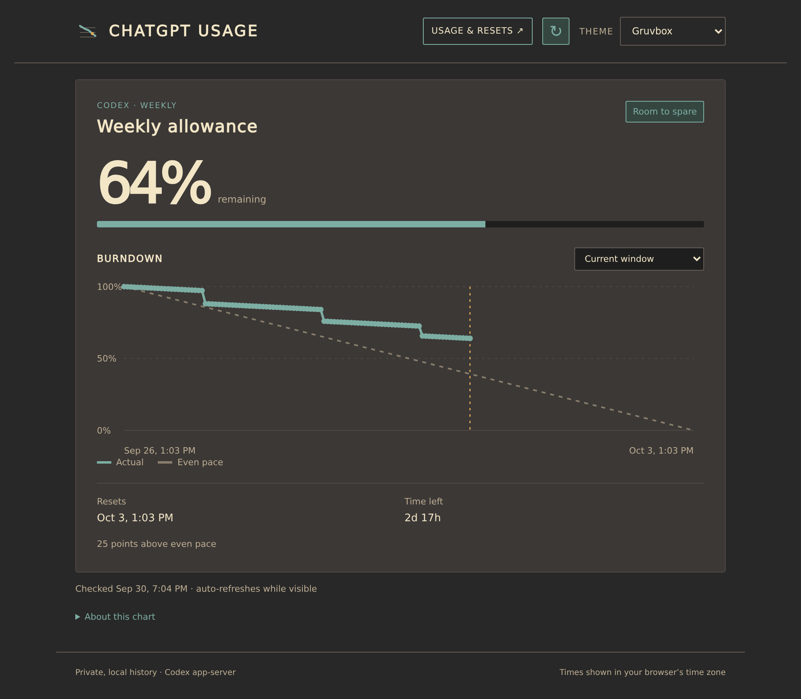
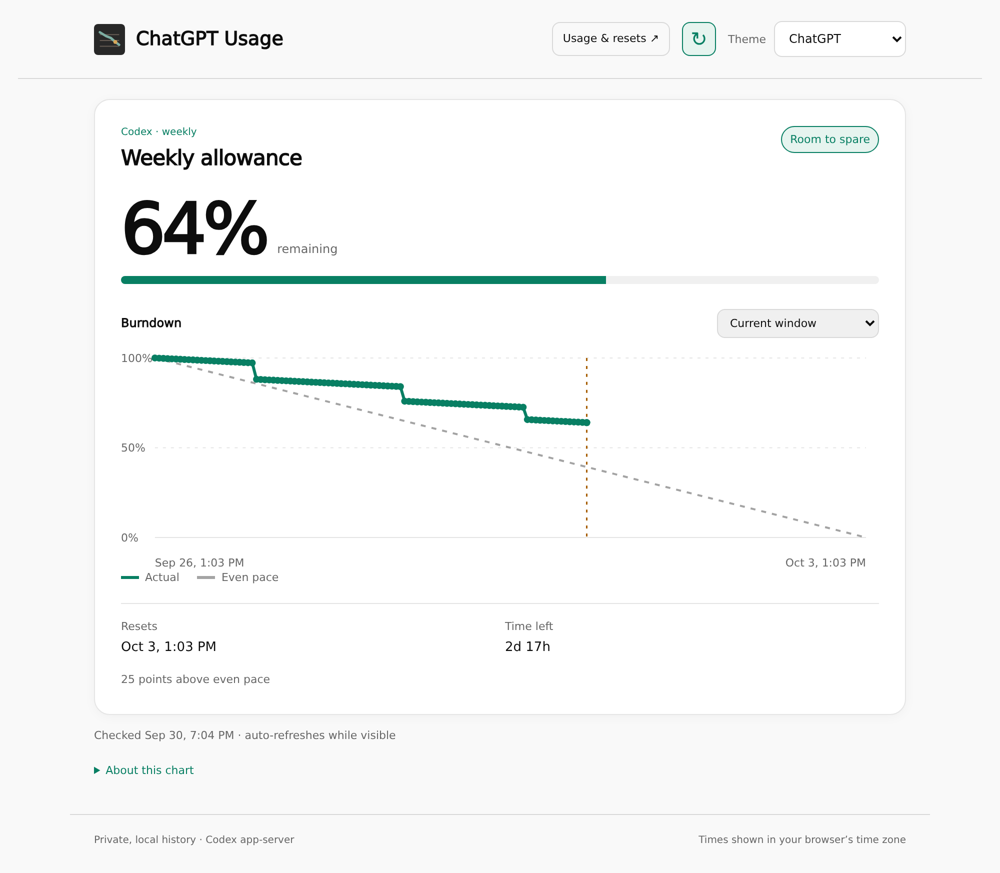
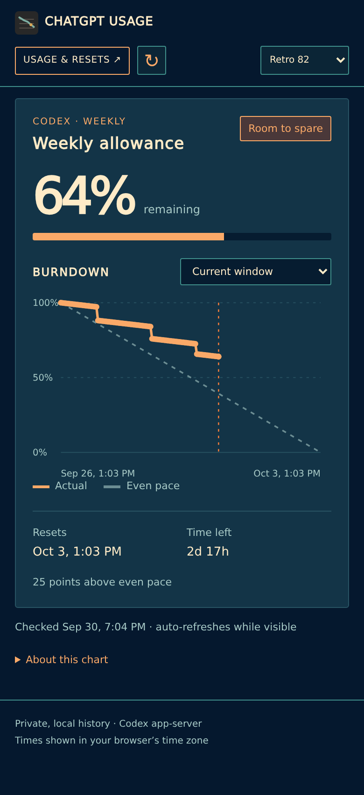

# ChatGPT Usage

A local dashboard for your Codex allowance: weekly quota remaining, reset time, usage history, and an even-pace guide. It reads the limits reported by Codex app-server using your existing ChatGPT login and stores snapshots in SQLite.



*Screenshots use synthetic data. No real account information is shown.*

The dashboard refreshes when opened, when you return to the tab, and every minute while visible. Automatic checks reuse a result from the past minute; the Refresh button requests a new sample. Browse earlier weeks using the chart selector. Choose Gruvbox, Flexoki Light, Retro 82, or a ChatGPT-inspired light theme; your choice is saved in your browser.

<details>
<summary>Light theme and mobile screenshots</summary>





</details>

## Quick start with mini-cloud

The easiest way to run this app is [mini-cloud](https://github.com/edofic/mini-cloud), which handles authenticated access, starts the dashboard on demand, and collects usage every ten minutes even while the web process is idle. Follow its [setup guide](https://github.com/edofic/mini-cloud/blob/main/docs/guide.md) first.

Requirements:

- Linux or macOS, Python 3.10 or later, and the [Codex CLI](https://developers.openai.com/codex/cli/). The app uses only Python's standard library.
- A ChatGPT login in Codex (`codex login`) for the **same OS user and home directory** that run mini-cloud. An API-key login does not supply ChatGPT plan allowance.
- Python on the mini-cloud service's `PATH`. On NixOS, include `pkgs.python3` in `services.mini-cloud.runtimePackages`.

1. Clone this repository into a `chatgpt-usage` directory directly under your mini-cloud `apps_dir`. For example, with `/mnt/share/apps` as your apps root:

   ```sh
   git clone https://github.com/edofic/chatgpt-usage.git /mnt/share/apps/chatgpt-usage
   cd /mnt/share/apps/chatgpt-usage
   cp .env.example .env
   ```

2. Find the Codex executable in the login shell where it works:

   ```sh
   command -v codex
   ```

   Set `CODEX_BIN` in `.env` to that absolute path. A systemd or launchd service may have a different `PATH` from your shell. The default `CODEX_BIN=codex` works when Codex is already on the **service's** `PATH`. mini-cloud loads `.env` for both the web process and the scheduled collector; it is ignored by Git.

3. Open the app through your mini-cloud app index or `chatgpt-usage.<base_domain>`. The included manifest requires authentication and membership of the `admin` group. Adjust `access_groups` for your configured identity provider. Keep authenticated access when serving the app remotely.

The first browser visit requests a sample immediately. The manifest's cron job then collects every ten minutes, and the web process stops after five idle minutes. For deployment details, see mini-cloud's [application manifest reference](https://github.com/edofic/mini-cloud/blob/main/docs/application-manifest.md) and [NixOS guide](https://github.com/edofic/mini-cloud/blob/main/docs/nixos.md).

## Run locally

From the repository root, with Codex logged in and available on your shell's `PATH`:

```sh
python3 app.py collect
PORT=8000 python3 app.py serve
```

Open <http://127.0.0.1:8000>. Browser refreshes collect new samples; for history while the browser is closed, schedule `python3 app.py collect` every ten minutes with cron or a systemd timer. Use absolute paths and the same logged-in user for scheduled jobs.

The standalone server binds only to loopback and has no built-in authentication. Use an authenticated reverse proxy, such as mini-cloud, for remote access.

| Variable | Default | Purpose |
| --- | --- | --- |
| `CODEX_BIN` | `codex` | Codex executable name or absolute path. |
| `DATABASE_PATH` | `data/usage.sqlite` beside `app.py` | SQLite history database; its parent directory is created automatically. |
| `PORT` | `8000` | Local HTTP port; mini-cloud supplies its assigned port. |

`app.py` reads environment variables directly; it does not load `.env` itself. For example, outside mini-cloud:

```sh
CODEX_BIN=/absolute/path/to/codex python3 app.py collect
CODEX_BIN=/absolute/path/to/codex PORT=8000 python3 app.py serve
```

## Try synthetic data

No Codex installation or login is needed to preview the dashboard:

```sh
python3 scripts/demo.py
```

Open <http://127.0.0.1:8000>. The demo creates a temporary database with a current week and a previous week, and serves the real dashboard. Refreshes remain synthetic, and your real usage database is untouched. Stop with Ctrl-C to remove the temporary data. Use `PORT=8001 python3 scripts/demo.py` if port 8000 is already occupied.

## Data and limits

The collector calls [`account/rateLimits/read`](https://learn.chatgpt.com/docs/app-server). This dashboard shows Codex allowance reported by that endpoint; it does not track every ChatGPT message limit. The web view focuses on the weekly quota, while the collector also retains other reported windows, including five-hour limits.

Only account identifiers, bucket metadata, percentages, and timestamps are stored. Credentials and raw RPC replies are not saved or printed by this app. The database, SQLite sidecar files, and environment files are ignored by Git; mini-cloud also ignores `data/` when watching for changes. History is retained until you delete it. Stop the app and collector before deleting the database and its sidecar files.

The even-pace line runs from 100% remaining at the inferred window start to 0% at reset. It is a planning reference and does not account for changing allowance, rolling windows, or resets between samples. Bursts between samples may be missed. Failed collection records a status code and leaves previous samples visible; a manual collector run exits nonzero on failure.

## License

Copyright 2026 Andraz Bajt. Licensed under the [Apache License 2.0](LICENSE).
